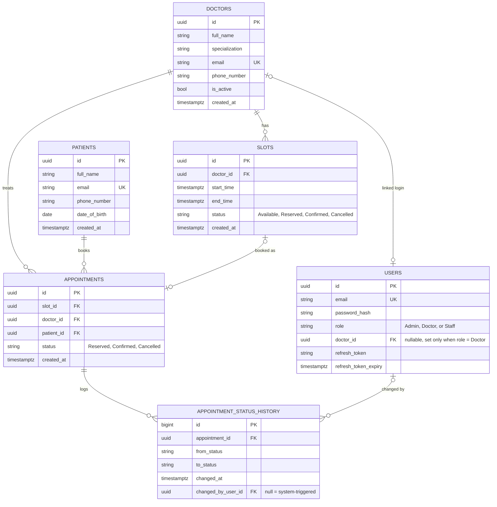

# 🏥 MediBook — Clinic Appointment Booking API

A production-style REST API for clinic appointment booking built with ASP.NET Core 10. Designed to handle real-world booking challenges — slot availability caching, double-booking prevention under concurrent load, and automated cloud deployment.

## Live Demo
> 🔗 `https://medibook-api-xxxxx.a.run.app/swagger` *(update after deploy)*

---

## Why I Built This

Most booking systems look simple on the surface but hide hard problems underneath — what happens when two patients book the same slot at exactly the same time? How do you keep availability data fast without hitting the database on every request? This project was built to answer those questions with production-grade solutions, not just happy-path CRUD.

---

## Architecture

The solution is split into shared projects with a clear dependency flow — Data has no project references, Infra depends only on Data, and MediBookAPI depends on both but never touches BookingDBContext or Repository<T> directly:

```
Client
  │
  │  GET /api/doctors (fetch doctors & slots)
  ▼
MediBookAPI
  ├── Controllers (DoctorController)
  │
  └── Services (DoctorServices/)
        │
        ├── IDoctorService / DoctorService
        │         │
        │         └── query via Unit of Work → return doctor data
        │
        └── IBookingUnitOfWork (injected into the service layer)
              │
              ├── IRepository<T> ─────────┐
              └── BookingUnitOfWork ───────┤── Transaction Management
                                          │   (EF Core + SaveChangesAsync)
                                          ▼
                              Update slot state:
                              Available → Reserved → Confirmed → Cancelled
                                          │
                                          ▼
                              Data (BookingDBContext)
                              ├── tbDoctors, tbPatients, tbUsers
                              ├── tbAppointments, tbSlots
                              └── tbAppointmentStatusHistory
                                          │
                                          ▼
                                   PostgreSQL (source of truth)
                                          │
                                          ▼
                                GitHub Actions CI/CD
                                          │
                                          ▼
                                GCP Cloud Run (live deployment)
```

---

## Tech Stack

| Layer | Technology                  |
|---|-----------------------------|
| API | ASP.NET Core 10             |
| Database | PostgreSQL (via EF Core)    |
| Cache | Redis (cache-aside pattern) |
| Containerisation | Docker (multi-stage build)  |
| CI/CD | GitHub Actions              |
| Cloud | GCP Cloud Run               |

---

## Database Structure

MediBook uses PostgreSQL as the source of truth and Redis as a disposable cache-aside layer — Redis never owns data, it only speeds up the one hot read path (available slots per doctor).

### Entity relationship diagram



### PostgreSQL DDL

```sql
CREATE TABLE users (
    id                   UUID PRIMARY KEY DEFAULT gen_random_uuid(),
    email                VARCHAR(150) NOT NULL UNIQUE,
    password_hash        TEXT NOT NULL,
    role                 VARCHAR(20) NOT NULL CHECK (role IN ('Admin','Doctor','Staff')),
    doctor_id            UUID REFERENCES doctors(id),
    refresh_token        TEXT,
    refresh_token_expiry TIMESTAMPTZ,
    created_at           TIMESTAMPTZ NOT NULL DEFAULT now()
);
 
CREATE TABLE doctors (
    id              UUID PRIMARY KEY DEFAULT gen_random_uuid(),
    full_name       VARCHAR(150) NOT NULL,
    specialization  VARCHAR(100) NOT NULL,
    email           VARCHAR(150) NOT NULL UNIQUE,
    phone_number    VARCHAR(30),
    is_active       BOOLEAN NOT NULL DEFAULT TRUE,
    created_at      TIMESTAMPTZ NOT NULL DEFAULT now(),
    updated_at      TIMESTAMPTZ NOT NULL DEFAULT now()
);
 
CREATE TABLE patients (
    id             UUID PRIMARY KEY DEFAULT gen_random_uuid(),
    full_name      VARCHAR(150) NOT NULL,
    email          VARCHAR(150) NOT NULL UNIQUE,
    phone_number   VARCHAR(30),
    date_of_birth  DATE,
    created_at     TIMESTAMPTZ NOT NULL DEFAULT now(),
    updated_at     TIMESTAMPTZ NOT NULL DEFAULT now()
);
 
CREATE TABLE slots (
    id            UUID PRIMARY KEY DEFAULT gen_random_uuid(),
    doctor_id     UUID NOT NULL REFERENCES doctors(id),
    start_time    TIMESTAMPTZ NOT NULL,
    end_time      TIMESTAMPTZ NOT NULL,
    status        VARCHAR(20) NOT NULL DEFAULT 'Available'
                    CHECK (status IN ('Available','Reserved','Confirmed','Cancelled')),
    created_at    TIMESTAMPTZ NOT NULL DEFAULT now(),
    updated_at    TIMESTAMPTZ NOT NULL DEFAULT now(),
    CONSTRAINT uq_doctor_slot_time UNIQUE (doctor_id, start_time)
);
 
CREATE TABLE appointments (
    id              UUID PRIMARY KEY DEFAULT gen_random_uuid(),
    slot_id         UUID NOT NULL REFERENCES slots(id),
    doctor_id       UUID NOT NULL REFERENCES doctors(id),
    patient_id      UUID NOT NULL REFERENCES patients(id),
    status          VARCHAR(20) NOT NULL DEFAULT 'Reserved'
                      CHECK (status IN ('Reserved','Confirmed','Cancelled')),
    created_at      TIMESTAMPTZ NOT NULL DEFAULT now(),
    updated_at      TIMESTAMPTZ NOT NULL DEFAULT now()
);
 
-- Defense-in-depth against double booking: only one active appointment per slot
CREATE UNIQUE INDEX uq_active_appointment_per_slot
    ON appointments (slot_id)
    WHERE status IN ('Reserved','Confirmed');
 
CREATE TABLE appointment_status_history (
    id                 BIGSERIAL PRIMARY KEY,
    appointment_id     UUID NOT NULL REFERENCES appointments(id),
    from_status        VARCHAR(20),
    to_status          VARCHAR(20) NOT NULL,
    changed_at         TIMESTAMPTZ NOT NULL DEFAULT now(),
    changed_by_user_id UUID REFERENCES users(id)
);
```

### Indexes

| Index | Table | Purpose |
|---|---|---|
| `uq_doctor_slot_time` on `(doctor_id, start_time)` | slots | A doctor can't have two slots starting at the same instant |
| `idx_slots_doctor_status_start` on `(doctor_id, status, start_time)` | slots | Backs the hottest query: available slots for a doctor, ordered by time |
| `uq_active_appointment_per_slot` (partial, unique) on `slot_id` where status in `('Reserved','Confirmed')` | appointments | The actual double-booking guard — a cancelled appointment frees the slot for rebooking |
| `idx_appointments_doctor` on `doctor_id` | appointments | Doctor's booking dashboard |
| `idx_appointments_patient` on `patient_id` | appointments | Patient's own booking history |
| `idx_status_history_appointment` on `appointment_id` | appointment_status_history | Full audit trail for a single booking |
| `idx_status_history_changed_by` on `changed_by_user_id` | appointment_status_history | Auditing which staff/admin/doctor made a change |

### Concurrency control

Double-booking prevention uses two independent layers:

1. **Optimistic concurrency via `xmin`** — `slots` and `appointments` are configured with `UseXminAsConcurrencyToken()` in EF Core, using Postgres' built-in `xmin` system column instead of a hand-maintained row-version column. Every `UPDATE` EF generates includes `WHERE xmin = <value read at load time>`; if a concurrent request already changed the row, the update affects zero rows and EF throws `DbUpdateConcurrencyException`, which the service layer turns into a `409 Conflict`.
2. **Partial unique index** (`uq_active_appointment_per_slot`) — a database-level guarantee that survives even outside the EF Core write path.
### Redis schema (cache-aside)

Redis is never the source of truth — only Postgres is. Cached data is disposable and always safe to drop.

| Key pattern | Value | TTL | Invalidated on |
|---|---|---|---|
| `slots:available:doctor:{doctorId}` | JSON array of `{ slotId, startTime, endTime }` | 5 min | Any booking or cancellation for that doctor |
| `doctor:{doctorId}:profile` | JSON of doctor name/specialization | 1 hr | Doctor profile update |

Patient PII (name, email, phone) is intentionally never cached in Redis — only slot availability and doctor profile data, neither of which is sensitive.
 
---

## Key Features

### 1. Redis Cache-Aside for Slot Availability
Available slots are cached in Redis on first request. Cache is invalidated immediately on every booking or cancellation — so users always see accurate availability without hitting the database on every request.

### 2. Optimistic Concurrency — No Double Bookings
Two patients booking the same slot at the same time is the core race condition of any booking system. Solved using EF Core row-versioning — if two requests try to book the same slot simultaneously, one succeeds and the other gets a clear conflict response.

### 3. Slot State Machine
Every appointment slot moves through a defined lifecycle:

```
Available → Reserved → Confirmed → Cancelled
```

Clear state transitions with a full audit trail — no ambiguous or orphaned bookings.

### 4. Keyless CI/CD via Workload Identity Federation
No long-lived service account keys stored as GitHub secrets. Authentication between GitHub Actions and GCP uses Workload Identity Federation — a more secure, keyless approach.

---

## Project Structure

```
MediBook/
├── Data/
│   ├── Dtos/
│   │   ├── AppointmentDtos.cs
│   │   ├── AuthDtos.cs
│   │   ├── DoctorDtos.cs
│   │   └── SlotDtos.cs
│   ├── Enums/
│   │   ├── Data.cs
│   │   └── Status.cs
│   ├── Migrations/
│   │   ├── 20260702043826_InitialCreate.cs
│   │   ├── 20260707083244_AddUserIdDefaultGuidGeneration.cs
│   │   ├── 20260708144525_AddXminConcurrencyToken.cs
│   │   └── BookingDBContextModelSnapshot.cs
│   ├── Models/
│   │   ├── BookingDBContext.cs
│   │   ├── tbAppointments.cs
│   │   ├── tbAppointmentStatusHistory.cs
│   │   ├── tbDoctors.cs
│   │   ├── tbPatients.cs
│   │   ├── tbSlots.cs
│   │   └── tbUsers.cs
│   └── Data.csproj
│
├── Infra/
│   ├── Repository/
│   │   ├── IRepository.cs
│   │   └── Repository.cs
│   ├── Services/
│   │   ├── JwtTokens/
│   │   │   ├── ITokenService.cs
│   │   │   ├── JwtSettings.cs
│   │   │   └── TokenService.cs
│   │   └── Redis/
│   │       ├── ICacheService.cs
│   │       └── RedisCacheService.cs
│   ├── UnitOfWork/
│   │   ├── IBookingUnitOfWork.cs
│   │   └── BookingUnitOfWork.cs
│   ├── Utility/
│   │   ├── Helper.cs
│   │   ├── PagingService.cs
│   │   └── SlotAvailabilityHelper.cs
│   └── Infra.csproj
│
├── MediBookAPI/
│   ├── Controllers/
│   │   ├── AppointmentController.cs
│   │   ├── AuthController.cs
│   │   ├── DoctorController.cs
│   │   ├── HealthController.cs
│   │   └── SlotsController.cs
│   ├── Seeding/
│   │   └── DbSeeder.cs
│   ├── Services/
│   │   ├── AppointmentServices/
│   │   │   ├── IAppointmentService.cs
│   │   │   └── AppointmentService.cs
│   │   ├── AuthServices/
│   │   │   ├── IAuthService.cs
│   │   │   └── AuthService.cs
│   │   ├── DoctorServices/
│   │   │   ├── IDoctorService.cs
│   │   │   └── DoctorService.cs
│   │   ├── HealthServices/
│   │   │   ├── IHealthService.cs
│   │   │   └── HealthService.cs
│   │   └── SlotServices/
│   │       ├── ISlotService.cs
│   │       └── SlotService.cs
│   ├── Program.cs
│   ├── appsettings.json
│   └── MediBookAPI.csproj
│
├── UnitTesting/
│   ├── AppointmentTestService.cs
│   ├── AuthServiceTests.cs
│   ├── ConcurrencyConfigurationTest.cs
│   ├── DoctorServiceTests.cs
│   ├── FakeCacheService.cs
│   ├── MigrationDriftTests.cs
│   ├── SlotServiceTest.cs
│   └── UnitTesting.csproj
│
├── .github/
│   └── workflows/
├── Dockerfile
├── docker-compose.yml
├── .dockerignore
├── .gitignore
├── MediBook.slnx
└── README.md
```

---

## API Endpoints

| Method | Route | Description                                   |
|---|---|-----------------------------------------------|
| `GET` | `/api/doctor/getbypaging` | List doctors with paging, sorting, and search |
| `GET` | `/api/doctor/getbyid?id={guid}` | Get a single doctor by ID                     |
| `POST` | `/api/doctor/create` | Create a new doctor                           |
| `PUT` | `/api/doctor/update` | Update doctor data                            |
| `DELETE` | `/api/doctor/softdelete?id={guid}` | Deactivate a doctor (soft delete)             |
| `DELETE` | `/api/doctor/harddelete?id={guid}` | Permanently delete a doctor                   |
| `POST` | `/api/appointment` | Book a slot (creates a Reserved appointment)   |
| `GET` | `/api/appointment/{id}` | Get booking details                           |
| `PUT` | `/api/appointment/{id}/confirm?changedByUserId={guid}` | Confirm a reserved appointment |
| `DELETE` | `/api/appointment/{id}?changedByUserId={guid}` | Cancel a booking (frees the slot back up) |
| `POST` | `/api/slots/create` | Create a new slot for a doctor                |
| `GET` | `/api/slots/getbyid?id={guid}` | Get a single slot by ID                       |
| `GET` | `/api/slots/available?doctorId={guid}` | List a doctor's available slots (Redis cache-aside) |
| `DELETE` | `/api/slots/cancel?id={guid}` | Cancel a still-available slot                 |
| `POST` | `/api/auth/register` | Register a new user account                   |
| `POST` | `/api/auth/login` | Log in and receive an access/refresh token pair |
| `POST` | `/api/auth/refresh-token` | Exchange an expired access token + refresh token for a new pair |
| `POST` | `/api/auth/revoke` | Revoke the current user's refresh token (requires auth) |
| `GET` | `/health` | Liveness probe                                |
| `GET` | `/health/ready` | Readiness — checks PostgreSQL + Redis         |

---

## Running Locally

```bash
git clone https://github.com/Kyawpaingoo/medibook.git
cd medibook
docker-compose up
```

API available at `http://localhost:8081`
Swagger UI at `http://localhost:8081/swagger`

### Default super admin account

On every startup, `DbSeeder.SeedSuperAdminAsync` (see [`MediBookAPI/Seeding/DbSeeder.cs`](MediBookAPI/Seeding/DbSeeder.cs)) checks for a user matching `SuperAdmin:Email` in configuration and, if none exists yet, creates one with the `Admin` role using a BCrypt-hashed `SuperAdmin:Password`. It's idempotent — it no-ops once the account exists — and skips entirely if either setting is missing, so it stays off by default outside of local development.

For local development (`appsettings.Development.json`), the seeded credentials are:

| Field | Value |
|---|---|
| Email | `superadmin@medibook.com` |
| Password | `SuperAdmin@2026!` |
| Role | `Admin` |

```bash
curl -X POST http://localhost:8081/api/auth/login \
  -H "Content-Type: application/json" \
  -d '{ "email": "superadmin@medibook.com", "password": "SuperAdmin@2026!" }'
```

⚠️ These are development-only defaults committed for convenience. Before deploying anywhere beyond local dev, set `SuperAdmin:Password` (and rotate `Jwt:Key`) via environment variables or a secrets manager instead of a checked-in `appsettings.*.json`.

---

## Example Request

```bash
# Book an appointment
curl -X POST http://localhost:8081/api/appointments \
  -H "Content-Type: application/json" \
  -d '{
    "doctorId": 1,
    "slotId": 42,
    "patientName": "John Doe",
    "patientEmail": "john@example.com"
  }'
```

```json
{
  "appointmentId": "appt-001",
  "status": "Reserved",
  "doctorName": "Dr. Smith",
  "slotTime": "2026-07-01T10:00:00Z",
  "createdAt": "2026-06-29T08:00:00Z"
}
```

---

## What I Would Add With More Time

- Integration tests using Testcontainers (real PostgreSQL + Redis in CI)
- Email/SMS notification on booking confirmation
- Admin dashboard for clinic staff built in React

---

Built by Kyaw Paing Oo · [LinkedIn](https://linkedin.com/in/kyaw-paing-oo-dev) · [GitHub](https://github.com/Kyawpaingoo)
